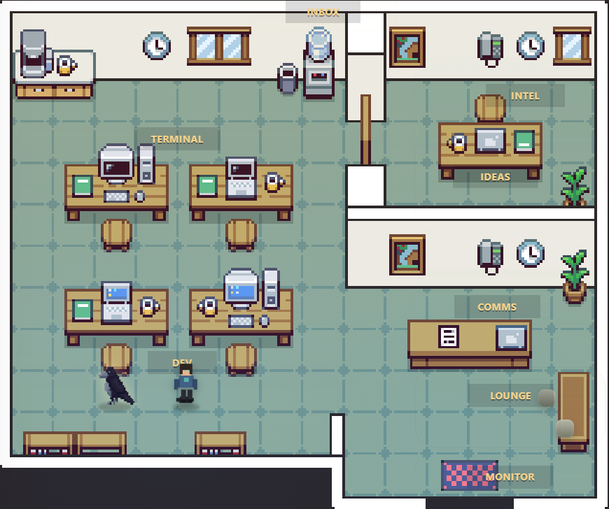

# PixelClaw Office

PixelClaw Office is a pixel-art operations room for AI agent work. It turns local session state into a live office scene: agents move between rooms, subagents appear as workers, the gateway feed sits on the left, and the right rail summarizes what is happening.



## What It Includes

- Full pixel office scene with room zones, signs, workers, gateway terminal, focus cards, detail popups, and motion paths.
- Read-only backend for local OpenClaw-compatible state.
- Privacy-preserving defaults.
- Demo mode for screenshots and development without touching real workspace data.
- Configurable agent and session sprites.
- Windows helper launchers for local use.

## Quick Start

```bash
npm install
npm test
npm start
```

Open:

```text
http://127.0.0.1:7823
```

Demo mode:

```bash
npm run start:demo
```

## Local Data

Requires Node.js 20.19 or newer.

Point PixelClaw Office at your local state directory:

```bash
OPENCLAW_PROFILE=work \
OPENCLAW_STATE_DIR="$HOME/.openclaw-work" \
OPENCLAW_CONFIG_PATH="$HOME/.openclaw-work/openclaw.json" \
npm start
```

The app is read-only. It watches session files and serves a local dashboard.

## Privacy

PixelClaw Office defaults to:

```bash
PIXEL_OFFICE_PRIVACY_MODE=aliases
```

That means real agent IDs, session keys, model/runtime details, paths, and gateway logs are reduced or aliased. For a trusted local machine, you can disable privacy mode:

```bash
PIXEL_OFFICE_PRIVACY_MODE=off npm start
```

Do not use private mode for screenshots or deployments you plan to publish.

## Custom Agents And Sprites

Sprite config lives in:

- `public/js/sprites/custom-config.js`
- `public/js/config/office-config.js`

Add your sprite image under:

```text
public/assets/characters/
```

Then add a profile:

```js
export const CUSTOM_SPRITE_PROFILES = {
  designer: {
    id: "designer",
    kind: "hero",
    src: "/assets/characters/designer.png",
    grid: { cols: 4, rows: 5 },
    scale: 1.05,
    className: "worker--sprite-human",
    states: {
      idle: { frame: [1, 0] },
      moving: { frame: [1, 0] },
      writing: { frame: [1, 3] },
      executing: { frame: [1, 2] },
      searching: { frame: [1, 3] },
      coordinating: { frame: [1, 4] },
      responding: { frame: [1, 2] },
      monitoring: { frame: [1, 1] }
    }
  }
};

export const CUSTOM_AGENT_SPRITES = {
  "designer-agent": "designer"
};
```

You can map by agent ID, display name, session kind, runtime kind, or rules:

```js
export const CUSTOM_SPRITE_RULES = [
  {
    profile: "designer",
    match: { entityType: "agent", station: "writing" }
  }
];
```

Remote sprite URLs work technically, but local files are better for privacy, reliability, and licensing.

## Many Agents

The office renderer handles more than two agents. Room slots are allocated by station, and focus cards can be tuned in:

```js
// public/js/config/office-config.js
export const OFFICE_CONFIG = {
  focusAgentIds: ["orchestrator", "builder", "research", "ops"],
  maxFocusCards: 4,
  showRoomSigns: true
};
```

`maxFocusCards` controls only the right-hand focus rail; the office scene can still render every agent/session it receives. Leave `showRoomSigns` off when your background art already contains room labels.

## Screenshots

The checked-in screenshot in `screenshots/` is generated from demo mode, not live workspace data.

To regenerate:

```bash
npm run start:demo
npx playwright screenshot http://127.0.0.1:7823 screenshots/pixelclaw-office-demo.png
```

## Safety Notes

- Keep it local unless you understand what data your OpenClaw state exposes.
- Do not commit `.env`, `logs/`, private screenshots, or copied runtime output.
- Public demos should use `PIXEL_OFFICE_DEMO_MODE=1`.
